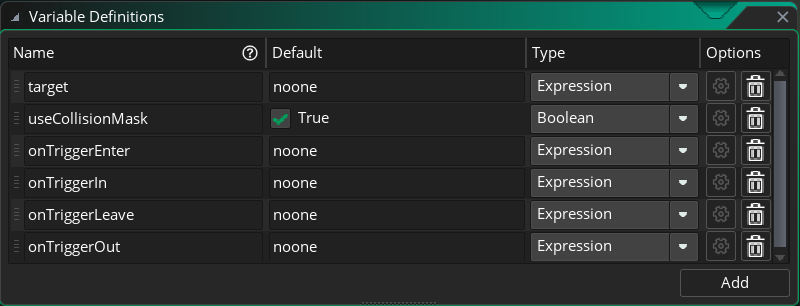

# GMS2Trigger
GMS2简易触发器

## 使用方法
先确保 `GMS2EventSystem` 中的 `obj_GMS2EventManager` 已存在于场景中。

拖入 `obj_GMS2Trigger` 对象。

对对象进行配置。

## 配置项

- target: 触发对象，该对象进入触发器才会触发事件。
- useCollisionMask: 是否使用碰撞盒做碰撞检测，默认为 `true`。使用碰撞盒时，触发器只会触发 `onTriggerEnter` 和 `onTriggerOut` 事件。
- onTriggerEnter: 进入事件脚本。
- onTriggerIn: 完全进入事件脚本。
- onTriggerLeave: 离开事件脚本。
- onTriggerOut: 完全离开事件脚本。

## 事件
事件触发时，脚本的作用域是 `target`。

### 触发条件

- 令触发对象为obj，obj的碰撞盒为obj.mask
- 令触发器为trigger，触发器的碰撞盒为trigger.mask

触发条件如下：
- onTriggerEnter：当obj在trigger外部，且obj.mask与trigger.mask相交时触发
- onTriggerIn：当obj.mask和trigger.mask从相交到obj完全进入trigger且不再相交时触发
- onTriggerLeave：当obj在trigger内部，且obj.mask与trigger.mask相交时触发
- onTriggerOut：当obj.mask和trigger.mask从相交到obj完全离开trigger且不再相交时触发
