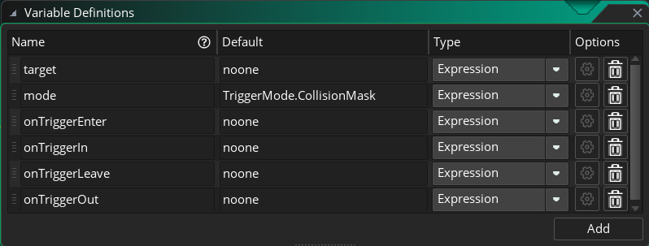

# GMS2Trigger
GMS2简易触发器

## 使用方法
先确保 `GMS2EventSystem` 中的 `obj_GMS2EventManager` 已存在于场景中。

拖入 `obj_GMS2Trigger` 对象。

对触发器对象进行配置。

> 由于 `obj_GMS2Trigger` 在 `create` 事件中需要注册事件，所以请确保在进入有触发器的场景前，就创建好了 `obj_GMS2EventManager` 。例如：创建一个 `rm_Init` 场景，专门用于初始化一些全局对象，其中就包括 `obj_GMS2EventManager。`

## 配置项

名称 | 功能
--- | ---
target | 触发对象，该对象进入触发器才会触发事件。
mode | mode: 触发模式，默认为 `CollisioinMask`，有三种触发模式：
mode -> `CollisioinMask` | 使用sprite的碰撞盒进行触发，该模式可以触发 `onTriggerEnter` 和 `onTriggerOut` 事件。
mode -> `Rectangle` | 使用矩形碰撞算法，会使用 `target` 的 `sprite` 边框作为第一个矩形，`trigger` 边框作为第二个矩形，然后做相交运算。该模式可以触发 `onTriggerEnter` 、`onTriggerIn` 、`onTriggerLeave` 和 `onTriggerOut` 事件
mode -> `Point` | 该模式以 `sprite` 的 `origin` 点 作为参照，进入触发器时，触发 `onTriggerIn` ，退出触发器时，触发 `onTriggerOut`
onTriggerEnter | 进入事件脚本。
onTriggerIn | 完全进入事件脚本。
onTriggerLeave | 离开事件脚本。
onTriggerOut | 完全离开事件脚本。

## 事件
事件触发时，脚本的作用域是 `target`。

### 触发条件

声明触发对象和触发器如下：
- 令触发对象为obj，obj的碰撞盒为obj.mask
- 令触发器为trigger，触发器的碰撞盒为trigger.mask

触发条件：
- onTriggerEnter：当obj在trigger外部，且obj.mask与trigger.mask相交时触发
- onTriggerIn：当obj.mask和trigger.mask从相交到obj完全进入trigger且不再相交时触发
- onTriggerLeave：当obj在trigger内部，且obj.mask与trigger.mask相交时触发
- onTriggerOut：当obj.mask和trigger.mask从相交到obj完全离开trigger且不再相交时触发
